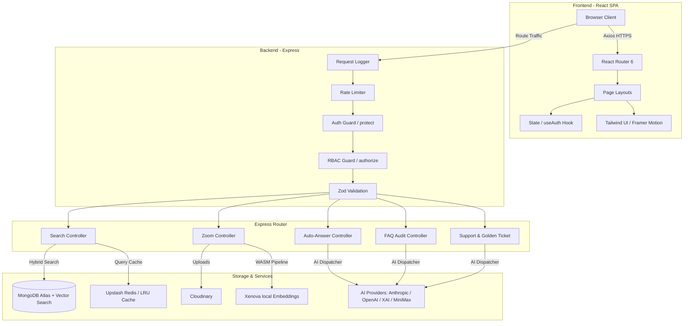
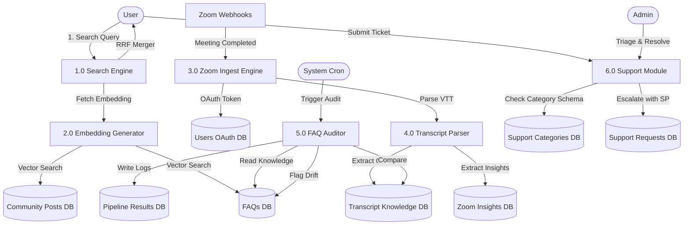
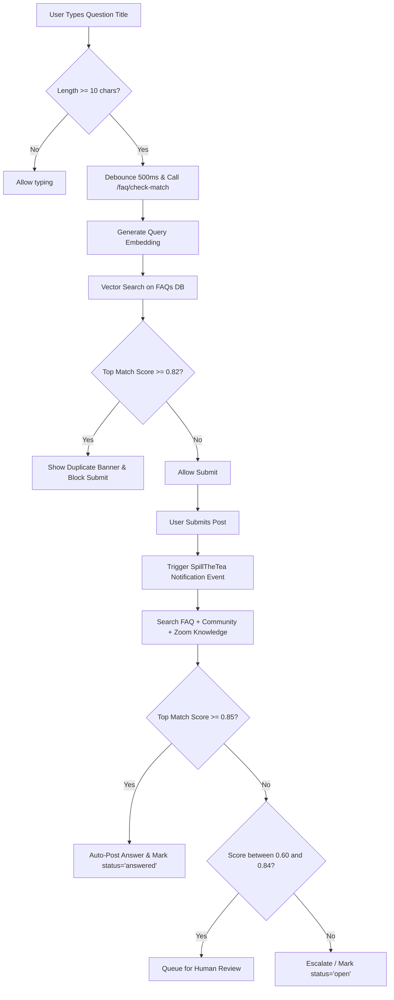
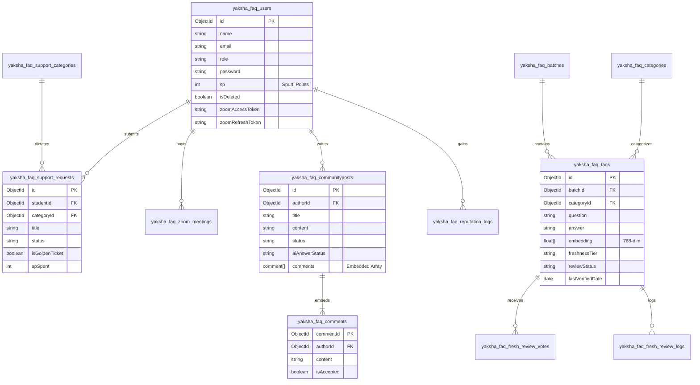

# Shamagama (Yaksha FAQ Portal) — Project Report & LaTeX Code

This document contains a brief executive summary, the detailed project report (Markdown), and the raw LaTeX source code for compiling the report into a professional PDF.

---

# PART 1: Executive Summary (Brief Summary)

**Shamagama** (internally designated as the **Yaksha FAQ Portal**) is an advanced, enterprise-ready FAQ management and community Q&A platform engineered to serve up to 1 million registered users. Designed to address the scaling limits of human-driven support, the system automates the FAQ lifecycle end-to-end to achieve a "zero-human" steady state.

### Key Highlights:
1. **Hybrid Retrieval System:** Combines local WebAssembly-powered 768-dimensional vector embeddings (`Xenova/multi-qa-mpnet-base-dot-v1`) with MongoDB `$text` keyword search, merged via **Reciprocal Rank Fusion (RRF)**.
2. **Automated Ingestion:** Features a Zoom integration with per-user OAuth. Webhook-triggered downloads automatically parse audio/video transcripts (`.vtt`), extract structured Q&A pairs using AI, and write them directly to the database.
3. **AI Auto-Answering:** An autonomous 24-hour scheduler matches unanswered posts against three knowledge stores (FAQ, Community Q&A, and Zoom Transcript Knowledge). High-confidence matches (score $\ge 0.85$) are auto-posted, mid-confidence matches are queued, and low-confidence queries are escalated.
4. **Self-Auditing Knowledge Base:** Runs a 6-hour auditing cron that uses LLMs to compare existing FAQs against newly ingested meetings, flagging drift, contradictions, or stale information.
5. **Freshness & Peer Review:** Assigns FAQs to `evergreen`, `seasonal`, or `volatile` freshness tiers. Stale FAQs automatically enter a peer-review queue where community members vote (`still_accurate` vs. `needs_update`) to auto-verify or escalate them.
6. **Gamified Prioritization:** Implements a "Golden Ticket" escalation queue. Users spend earned Spurti Points (SP) to prioritize urgent tickets, subject to a strict 48-hour cooldown.
7. **Soft User Lifecycle:** Preserves database integrity and historical attribution by anonymizing deleted users (rewriting credentials and names) rather than hard-deleting records.

---

# PART 2: Detailed Project Report (Markdown)

# Crowd Sourcing FAQ Project Report: Shamagama (Yaksha FAQ Portal)

## 1. Title Page
* **Repository Name:** Shamagama (Yaksha FAQ Portal)
* **Team:** vicharanashala (Team CS15)
* **Repository Link:** [https://github.com/vicharanashala/crowd-source-faq](https://github.com/vicharanashala/crowd-source-faq)
* **Status:** Release v1.70 (Production-Ready)

---

## 2. Executive Summary
Organizations running large-scale communities—such as open-source projects, universities, customer-support portals, and cohort-based training programs—face an exponential growth of repetitive queries. Conventional FAQ systems are static, require extensive manual upkeep, and quickly become obsolete. 

**Shamagama** resolves this bottleneck by turning conversational exhaust (e.g., Zoom lectures, meeting transcripts, forum comments) into a structured, self-healing knowledge base. Built using a robust MERN stack (MongoDB, Express, React, Node) and local AI embeddings, Shamagama runs background pipelines that ingest transcripts, auto-answer community posts, audit FAQs for drift, and coordinate community-driven peer reviews. The platform scales gracefully to support 1 million users, maintaining high search relevance, strict data integrity, and low maintenance overhead.

---

## 3. Introduction
### 3.1 Problem Statement
Modern communities generate knowledge at a rapid rate, yet this knowledge remains siloed in Zoom meetings, chat logs, and forum threads. When users have questions:
* They ask questions that have been answered before, burdening administrators.
* Searching past recordings is tedious and rarely yields precise timestamps or exact answers.
* Human moderators must manually clean, verify, and publish FAQs.
* Over time, software updates or policy changes cause FAQs to "drift" and become inaccurate, with no automated tracking mechanism.

### 3.2 The Shamagama Solution
Shamagama provides a full-stack, AI-orchestrated community Q&A portal centered around four automation pillars:
* **Zero-Touch Ingestion:** Automatically extracts Q&A pairs from Zoom transcripts.
* **Zero-Touch Answering:** Automatically answers community posts using hybrid search and context-guided LLM responses.
* **Zero-Touch Quality Control:** Periodically checks approved FAQs against newer ingestion inputs to flag outdated or contradictory answers.
* **Zero-Touch User Lifecycle:** Anonymizes user accounts upon request to comply with privacy regulations (GDPR) while keeping user contributions intact to prevent broken comment threads.

---

## 4. System Design & Architecture
Shamagama employs a decoupled three-tier architecture: a React Single Page Application (SPA), an Express REST API, and a MongoDB Atlas database.

### 4.1 System Architecture Diagram


### 4.2 Use-Case Diagram

```mermaid
flowchart TD
    subgraph Users [Actors]
        G[Guest User]
        U[Authenticated User]
        M[Moderator]
        A[Admin]
        S[System Scheduler]
    end

    subgraph UseCases [Use Cases]
        %% Guest
        G --> UC1(Select Batch & Browse FAQs)
        G --> UC2(Ask RAG AI Assistant)

        %% User
        U --> UC3(Ask Community Post)
        U --> UC4(Connect Zoom OAuth)
        U --> UC5(Vote in Peer Review)
        U --> UC6(Submit Support Ticket)
        U --> UC7(Golden Ticket Priority Escalation)

        %% Moderator / Admin
        M --> UC8(Triage Flags & Escalations)
        M --> UC9(Ban / Suspend Users)
        
        A --> UC10(Configure Category Schemas)
        A --> UC11(Review Zoom Insights)
        A --> UC12(Toggle Feature Flags)

        %% Scheduler
        S --> UC13(Run Auto-Answer Pipeline - 24h)
        S --> UC14(Run FAQ Audit Pipeline - 6h)
        S --> UC15(Run FAQ Freshness Check - Daily)
    end
```


### 4.3 Dataflow Diagram (DFD Level 1)


### 4.4 Ask-a-Question Flowchart


### 4.5 Database ER Diagram


---

## 5. Implementation
### 5.1 Tech Stack & Justification
* **MongoDB & Mongoose:** Schema flexibility allows dynamic data structures. Crucially, MongoDB Atlas natively supports vector indexes. This enables cosine-similarity checks right alongside traditional text indexing, avoiding the cost and complexity of a separate vector store (like Pinecone or Milvus).
* **Express.js:** Lightweight routing framework. Excellent middleware support makes it easy to inject JWT verification, rate limiting, request-scoped context tracking, and security headers (Helmet).
* **React 18 & Vite:** React provides declarative component UI and handles nested comment trees using optimistic state updates. Vite serves as a lightning-fast build tool, providing instant Hot Module Replacement (HMR) for local development.
* **Node.js (TypeScript ESM):** Using ES Modules ensures modern Javascript standards. TypeScript enforces strict types across routes, models, and controllers, mitigating runtime errors in production.

### 5.2 Module / Feature Breakdown
The project structure enforces strict boundaries between features:
1. **Search & Vector Service:** Handles the local Xenova embedding pipeline. When a query comes in, it passes through `vttParser.ts` and `embeddings.ts`, generating a 768-dimensional vector to perform a `$vectorSearch` in MongoDB Atlas.
2. **AI Provider Gateway:** Standardizes requests to Anthropic, OpenAI, XAI, and MiniMax via a unified `aiClient.ts` wrapper. It reads configuration parameters on a per-pipeline basis, allowing operators to run cheap models (like MiniMax or GPT-4o-mini) for routing, and expensive models (like Claude 3.5 Sonnet) for detailed FAQ audits.
3. **Zoom Integration Pipeline:** Handles OAuth handshake and encrypted token storage using AES-256-GCM. Parses webhooks, triggers background downloads, cleans transcripts, and generates dual outputs.
4. **Community Forum & Moderation Module:** Manages threads, nested comments, and duplicate checking. Tracks flag counters and links to the reputation system, which awards badges and updates the leaderboard based on active contributions.
5. **Support Ticket Module:** Generates dynamic forms by checking the Category schema. It validates incoming ticket data against admin-editable requirements before saving.
6. **Golden Ticket Priority Queue:** Manages Spurti Points balances. It handles the deduction, cooldown locks, and priority sorting for escalated queries.

---

## 6. Feature Spotlight
This section showcases the standout innovations of the Shamagama portal. Each highlighted feature includes its purpose, impact, and a breakdown of a 60-second screen-recorded demo walk-through.

### 6.1 Zoom Transcript Ingestion with OAuth
* **Purpose:** Convert passive audio/video meetings into active, searchable knowledge without human intervention.
* **Impact:** Automates knowledge base expansion. Users don't need to manually write down notes or Q&As; the system ingests transcripts instantly.
* **Real-World Usefulness:** A student misses a Zoom seminar. Within minutes of the session ending, they can search the portal for a niche phrase mentioned by the lecturer and find the exact question and answer pair.
* **Demo Clip (15 seconds):** Shows a user connecting their Zoom account under `/account`, a simulated webhook firing, the transcript parsing, and a new entry instantly appearing on `/admin/zoom-insights` for review, as well as a RAG assistant sourcing it.

### 6.2 AI Auto-Answer Pipeline
* **Purpose:** Instantly resolve unanswered forum questions by executing parallel searches and LLM generation.
* **Impact:** Cuts down support queue response times from days to seconds.
* **Real-World Usefulness:** A user posts a query on the forum late at night. The scheduler runs, matches it against past transcript knowledge, and replies within seconds with an accurate answer, removing the need for a moderator to log in.
* **Demo Clip (15 seconds):** Shows a user submitting a new post, the admin dashboard clicking **Run AI**, and the system automatically matching the query against a Zoom transcript, appending a verified answer, and firing a notification.

### 6.3 FAQ Audit & Peer-Review Freshness
* **Purpose:** Detect information drift and stale FAQs using periodic AI audits and community voting.
* **Impact:** Prevents the accumulation of outdated, incorrect documentation.
* **Real-World Usefulness:** An API changes in a new software release. The system flags that old FAQs conflict with new Zoom meeting discussions, opening a peer-vote window where experts update the resource.
* **Demo Clip (15 seconds):** Shows a volatile FAQ expiring, entering the `/community/review-queue`, a user voting `needs_update`, and the FAQ landing in the Moderator's queue with a clear drift reason card.

### 6.4 Golden Ticket Spurti Points Escalation
* **Purpose:** Let users spend earned reputation points to prioritize urgent support tickets.
* **Impact:** Gamifies quality contributions while keeping the support queue fair.
* **Real-World Usefulness:** A student has an urgent server crash. They spend 100 Spurti Points to move their ticket to the top of the admin triage board, bypass the general queue, and get a response within minutes.
* **Demo Clip (15 seconds):** Shows a user submitting a ticket with "Golden Ticket" checked, the deduction of Spurti Points, the 48h cooldown lock showing on their dashboard, and the admin panel sorting the ticket at the very top of the escalation list.

---

## 7. Challenges & Limitations
1. **Local Embedding Performance vs. Memory:** Running Xenova Transformers locally on the Node.js backend using WebAssembly is cost-effective, but it consumes significant memory and CPU during startup and backfilling. For massive datasets, this pipeline must be offloaded to a dedicated worker.
2. **Zoom OAuth Token Refresh Races:** Zoom access tokens expire every hour. In high-concurrency environments, multiple webhooks can trigger parallel token refreshes, resulting in race conditions. This was resolved by implementing a centralized locking mechanism and an in-memory token cache (`zoomCache.ts`).
3. **Cron Implementation Gap:** While the FAQ Freshness daily cron logic is written inside `freshnessController.ts`, it is not wired to a scheduler library (like `node-cron`) inside `server.ts`. This requires administrators to call the endpoint manually or set up an external scheduler trigger.

---

## 8. Future Enhancements
* **Automated Cron Wiring:** Wire the freshness daily check and the auto-answer queue directly into a resilient scheduler runner like BullMQ.
* **Discord & Slack Integrations:** Package the system search as a chat bot. This allows users to query the FAQ database directly from their daily chat apps.
* **Real-Time WebSockets Sync:** Replace polling with a persistent WebSocket connection (using the SpillTheTea pipeline) to deliver instant comment updates, upvote changes, and ticket status alerts.
* **Multi-Tenant Batches:** Upgrade the batch scoping model to support full multi-tenancy, enabling different organizations to run isolated instances of Shamagama on the same server.

---

## 9. Conclusion
Shamagama successfully demonstrates that FAQ portals do not need to be static, high-maintenance repositories. By coupling hybrid vector search with automated Zoom ingestion, LLM auditing, and reputation-driven community escalation, the platform ensures that knowledge is captured, curated, and kept accurate. This system provides a scalable, production-ready blueprint for modern organizations looking to automate knowledge management at scale.

---

# PART 3: LaTeX Source Code

Copy the code below into a file named `project_report.tex` to compile the report into a PDF.

```latex
\documentclass[11pt,a4paper]{article}
\usepackage[utf8]{inputenc}
\usepackage[margin=1in]{geometry}
\usepackage{hyperref}
\usepackage{booktabs}
\usepackage{graphicx}
\usepackage{listings}
\usepackage{color}
\usepackage{amsmath}
\usepackage{tikz}
\usetikzlibrary{shapes,arrows,positioning,shadows}
\usepackage{mdframed}
\usepackage{enumitem}

\definecolor{lightgray}{rgb}{0.95,0.95,0.95}
\definecolor{darkgray}{rgb}{0.4,0.4,0.4}
\definecolor{editorGreen}{rgb}{0,0.5,0}

\lstset{
    backgroundcolor=\color{lightgray},
    basicstyle=\ttfamily\small,
    breakatwhitespace=false,
    breaklines=true,
    captionpos=b,
    commentstyle=\color{editorGreen},
    keepspaces=true,
    keywordstyle=\color{blue},
    numbers=left,
    numberstyle=\tiny\color{darkgray},
    showspaces=false,
    showstringspaces=false,
    showtabs=false,
    tabsize=2,
    frame=single
}

\hypersetup{
    colorlinks=true,
    linkcolor=blue,
    filecolor=magenta,      
    urlcolor=cyan,
    pdftitle={Shamagama (Yaksha FAQ Portal) Project Report},
    pdfpagemode=FullScreen,
}

\title{Shamagama (Yaksha FAQ Portal)\\ \large Crowd Sourcing FAQ Project Report}
\author{Team vicharanashala}
\date{June 2026}

\begin{document}

\maketitle

\begin{center}
    \textbf{Repository Name:} Shamagama (Yaksha FAQ Portal) \\
    \textbf{Repository Link:} \href{https://github.com/vicharanashala/crowd-source-faq}{github.com/vicharanashala/crowd-source-faq}
\end{center}

\newpage
\tableofcontents
\newpage

\section{Executive Summary}
Organizations running large-scale communities face an exponential growth of repetitive queries. Conventional FAQ systems are static, require extensive manual upkeep, and quickly become obsolete. 

\textbf{Shamagama} (internally designated as the \textbf{Yaksha FAQ Portal}) is an advanced, enterprise-ready FAQ management and community Q\&A platform engineered to serve up to 1 million registered users. It automates the FAQ lifecycle end-to-end to achieve a ``zero-human'' steady state. The platform combines hybrid vector search (local 768-dim embeddings merged via Reciprocal Rank Fusion) with automated Zoom ingestion, LLM-based FAQ auditing, reputation-based peer reviews, and gamified ticket prioritization (Golden Tickets).

\section{Introduction}
\subsection{Problem Statement}
Modern communities generate knowledge at a rapid rate, yet this knowledge remains siloed in Zoom meetings, chat logs, and forum threads. When users have questions, they ask queries that have been answered before, burdening administrators. Searching past recordings is tedious, and manual verification is slow. Over time, software updates or policy changes cause FAQs to ``drift'' and become inaccurate, with no automated tracking mechanism.

\subsection{The Shamagama Solution}
Shamagama provides a full-stack, AI-orchestrated community Q\&A portal centered around four automation pillars:
\begin{itemize}
    \item \textbf{Zero-Touch Ingestion:} Automatically extracts Q\&A pairs from Zoom transcripts.
    \item \textbf{Zero-Touch Answering:} Automatically answers community posts using hybrid search and context-guided LLM responses.
    \item \textbf{Zero-Touch Quality Control:} Periodically checks approved FAQs against newer ingestion inputs to flag outdated or contradictory answers.
    \item \textbf{Zero-Touch User Lifecycle:} Anonymizes user accounts upon request to comply with privacy regulations (GDPR) while keeping user contributions intact.
\end{itemize}

\section{System Design \& Architecture}
Shamagama employs a decoupled three-tier architecture: a React Single Page Application (SPA), an Express REST API, and a MongoDB Atlas database.

\subsection{Architectural Components}
\begin{enumerate}
    \item \textbf{Client Layer (React SPA):} Formed with React 18, TypeScript, Tailwind CSS, Framer Motion, and Axios.
    \item \textbf{API Middleware Gateway (Express):} Comprises rate limiting, security headers (Helmet), authentication verification (JWT), and request validation (Zod).
    \item \textbf{Service Controllers:} Organizes business logic including search, community posts, Zoom OAuth, and moderation.
    \item \textbf{Data \& Intelligence Layer:} MongoDB Atlas (Vector indexes), Upstash Redis (optional cache), Cloudinary, and local WebAssembly embeddings.
\end{enumerate}

\subsection{Database Schema Design}
The relational structure of key entities in Shamagama is summarized below:
\begin{description}
    \item[User:] Accounts, roles, Zoom OAuth tokens, Spurti Points balance ($sp$), and soft-delete flags.
    \item[FAQ:] Question, answer, 768-dim embedding array, freshness tier (evergreen/seasonal/volatile), and lastVerifiedDate.
    \item[CommunityPost:] Title, content, status, and an embedded array of comment sub-schemas to optimize read queries.
    \item[SupportRequest:] Dynamic context fields, troubleshooting status, and Golden Ticket flags.
\end{description}

\section{Implementation}
\subsection{Tech Stack \& Justification}
\begin{itemize}
    \item \textbf{MongoDB Atlas \& Mongoose:} Native Vector Search integration enables cosine-similarity vector queries directly in the primary database without requiring a separate vector database.
    \item \textbf{Express.js:} Fast, minimalist framework with excellent middleware support for security and authentication.
    \item \textbf{React 18 \& Vite:} Enables optimistic UI updates for nested comments and fast client routing.
    \item \textbf{Node.js (TypeScript ESM):} Guarantees type-safe operations across services and conforms to modern ES modules syntax.
\end{itemize}

\subsection{Module / Feature Breakdown}
\begin{description}
    \item[Vector Search Service:] Generates local 768-dim embeddings via \texttt{@xenova/transformers} (\texttt{multi-qa-mpnet-base-dot-v1}) and merges results using Reciprocal Rank Fusion (RRF).
    \item[AI Provider Gateway:] Abstracted client supporting Anthropic, OpenAI, XAI, and MiniMax with dynamic per-pipeline configurations.
    \item[Zoom Pipeline:] Captures webhooks, downloads transcripts using refreshed OAuth tokens, parses VTT files, and outputs to review insights and auto-approved knowledge bases.
    \item[Moderation \& Reputation:] Tracks Spurti Points, issues warnings, logs bans, and handles user account anonymization.
\end{description}

\section{Feature Spotlight}
\subsection{Zoom Ingestion with OAuth (Demo Duration: 15s)}
Allows lecturers or hosts to connect their Zoom accounts via OAuth. When a session ends, the recording transcript is automatically parsed and converted into search-ready vector documents.
\subsection{AI Auto-Answer Pipeline (Demo Duration: 15s)}
Unanswered forum posts are checked against the knowledge bases. Answers with high confidence ($\ge 0.85$) are auto-posted, reducing queue times.
\subsection{FAQ Audit \& Freshness (Demo Duration: 15s)}
FAQs are checked for correctness against new materials. Expired FAQs enter a peer-review voting system to be verified or escalated.
\subsection{Golden Ticket Spurti Points Escalation (Demo Duration: 15s)}
Allows students to spend earned SP points to push urgent tickets to the top of the admin queue, restricted by a 48h cooldown.

\section{Challenges \& Limitations}
\begin{itemize}
    \item \textbf{Resource Consumption:} Local embedding generation is resource-intensive for high-concurrency environments.
    \item \textbf{OAuth Race Conditions:} Parallel webhooks can trigger simultaneous Zoom token refreshes. A locking cache was introduced to resolve this.
    \item \textbf{Unwired Freshness Cron:} The freshness pipeline cron job is coded but requires manual trigger setup or wiring to a scheduler in \texttt{server.ts}.
\end{itemize}

\section{Future Enhancements}
\begin{itemize}
    \item Implement BullMQ for robust backend job queue scheduling.
    \item Create Slack and Discord search bots.
    \item Transition event streams to full-duplex WebSockets.
    \item Build a multi-tenant batch management layout.
\end{itemize}

\section{Conclusion}
Shamagama shows that FAQ systems do not need to be static. By coupling hybrid vector search with automated Zoom ingestion, LLM auditing, and reputation-driven community escalation, the platform ensures that knowledge is captured, curated, and kept accurate.

\end{document}
```
